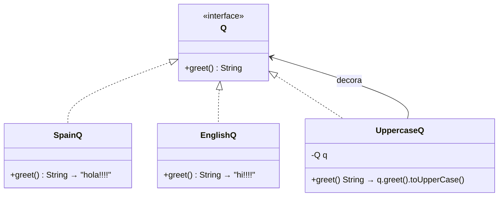

# 🔄 Análisis Punto 1.b — Cambiar resultado a inglés y mayúsculas

## Arquitectura actual

El proyecto utiliza el **patrón Strategy** combinado con el **patrón Decorator**:



El flujo actual es:
1. `ServiceWithQ` recibe por inyección el bean `Q` marcado como `@Primary`
2. Actualmente `@Primary` apunta a `getQ()` → `SpainQ` → devuelve `"hola!!!!"`
3. Al llamar al endpoint, el servicio ejecuta `q.greet()` y retorna el resultado

---

## Propuesta: resultado en inglés y mayúsculas

Para lograr **ambos requisitos** (inglés + mayúsculas), se aprovecha el **patrón Decorator** que ya existe en `UppercaseQ`. Solo se necesitan **dos cambios** en `Config.java`:

1. Mover `@Primary` al bean `getQ3()` (el que usa `UppercaseQ`)
2. Cambiar el argumento interior de `SpainQ` a `EnglishQ`

**Archivo:** [Config.java](file:///c:/Users/usuario/Downloads/challenge_monnet/challenge/src/main/java/com/monnetpayments/challenge/api/config/Config.java)

```diff
-    @Primary
     @Bean
     Q getQ(){
         return new SpainQ();
     }

     @Bean
     Q getQ2(){
         return new EnglishQ();
     }

+    @Primary
     @Bean
     Q getQ3(){
-        return new UppercaseQ(new SpainQ());
+        return new UppercaseQ(new EnglishQ());
     }
```

**Resultado:** `curl http://localhost:8099/challenge/greet/` → **`HI!!!!`**

---

## ¿Por qué funciona?

La cadena de ejecución con este cambio sería:

```
ServiceWithQ.doAGreet()
  └─► UppercaseQ.greet()            ← bean @Primary (getQ3)
        └─► EnglishQ.greet()        ← decorado interno
              └─► return "hi!!!!"
        └─► return "hi!!!!".toUpperCase()
              └─► return "HI!!!!"
```

| Concepto | Rol en la solución |
|----------|-------------------|
| **Patrón Strategy** | `EnglishQ` aporta el idioma inglés (`"hi!!!!"`) |
| **Patrón Decorator** | `UppercaseQ` envuelve `EnglishQ` y aplica `.toUpperCase()` → `"HI!!!!"` |
| **`@Primary`** | Indica a Spring que inyecte `getQ3` (el decorado) en `ServiceWithQ` |
| **Inversión de Control** | No se modifica ninguna clase de dominio ni el servicio, solo la configuración |

> [!IMPORTANT]
> La ventaja de este diseño es que **cambiar el comportamiento del endpoint no requiere modificar código de dominio ni de servicio**, solo la configuración de Spring (`Config.java`). Esto respeta el **Principio Abierto/Cerrado (OCP)** de SOLID.
