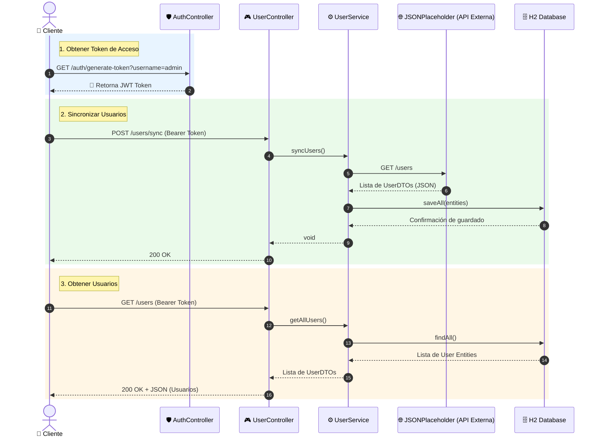

<div align="center">
  <h1>🚀 User Service</h1>
  <p><b>Microservicio para la Gestión y Sincronización de Usuarios</b></p>
</div>

---

## 📖 Descripción del Proyecto

**User Service** es un microservicio diseñado para administrar usuarios de manera local e integrar datos desde una API externa (JSONPlaceholder). La aplicación ofrece un mecanismo robusto para sincronizar los usuarios en una base de datos `H2` y provee endpoints seguros respaldados por **JSON Web Tokens (JWT)** para la recuperación de esta información.

---

## 🛠️ Stack Tecnológico

El proyecto está construido usando las siguientes tecnologías:

*   **☕ Java 21**: Lenguaje principal.
*   **🍃 Spring Boot (3.5.13)**: Framework base del microservicio.
    *   `spring-boot-starter-web`: Para la capa REST.
    *   `spring-boot-starter-data-jpa`: Para persistencia y ORM.
    *   `spring-boot-starter-security`: Para protección de endpoints.
    *   `spring-boot-starter-actuator`: Para el monitoreo y métricas de salud.
*   **🛡️ JWT (0.12.6)**: Para la generación y validación de tokens de seguridad.
*   **🗄️ H2 Database**: Base de datos en memoria para pruebas rápidas y entorno local.
*   **🗺️ MapStruct (1.6.3)**: Simplificación de la conversión entre Entidades y DTOs.
*   **🌶️ Lombok**: Reducción del código boilerplate (Getters, Setters, etc.).
*   **📄 OpenAPI (Swagger UI)**: Para la documentación interactiva de la API.

---

## 🛣️ Endpoints

| Método HTTP | Endpoint | Descripción | Requiere Autenticación |
| :---: | :--- | :--- | :---: |
| `GET` | `/auth/generate-token?username={username}` | Genera un token JWT de acceso para las pruebas. | ❌ No |
| `POST` | `/users/sync` | Consume la API externa (JSONPlaceholder) y guarda o sincroniza los usuarios en la base de datos local. | ✅ Sí (Bearer Token) |
| `GET` | `/users` | Retorna todos los usuarios actualmente sincronizados en la base de datos. | ✅ Sí (Bearer Token) |
| `GET` | `/users/{id}` | Busca y retorna la información de un usuario específico según su ID. | ✅ Sí (Bearer Token) |

---

## 🔄 Diagrama de Secuencia

El siguiente diagrama ilustra el flujo de sincronización y obtención de usuarios. Se aprecia cómo un cliente primero obtiene su token de acceso, para posteriormente poder interactuar de forma segura con el controlador principal de usuarios.



---

## 🚀 Cómo Ejecutar el Proyecto

1. **Clonar desde el repositorio** (o dirigirse a la raíz del proyecto):
   ```bash
   cd user-service
   ```

2. **Compilar y construir el proyecto**:
   Si tienes Maven instalado:
   ```bash
   mvn clean install
   ```
   También puedes usar el *wrapper* de Maven que viene con el proyecto:
   ```bash
   ./mvnw clean install
   ```

3. **Ejecutar la aplicación**:
   ```bash
   ./mvnw spring-boot:run
   ```

4. **Acceder a la documentación Swagger (si está activada)**:
   Puedes comprobar los endpoints interactivos ingresando desde el navegador a:
   [http://localhost:8080/swagger-ui.html](http://localhost:8080/swagger-ui.html) (Asegúrate de que la aplicación corra en el puerto 8080).

5 **Usar Postman**:
   Se incluye una colección lista para ser importada en Postman `proyecto-money.postman_collection.json`. En ella puedes lanzar la petición para obtener el *Token de Autenticación*, y luego usarlo en las peticiones subsiguientes.
